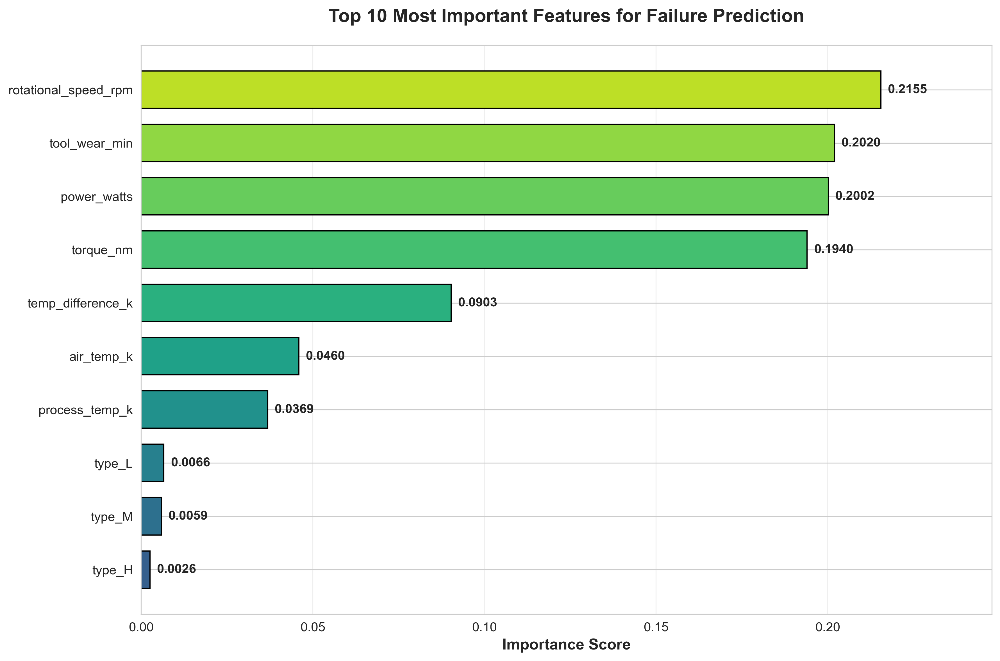
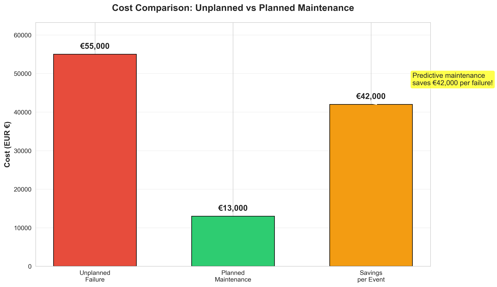

# Predictive Maintenance Analysis

[](https://streamlit.io/)
[](https://www.python.org/)
[](https://scikit-learn.org/)
[](https://pandas.pydata.org/)

> **End-to-end data analysis and machine learning project for predicting industrial equipment failures, enabling proactive maintenance strategies for German manufacturing companies.**

---

## Table of Contents

- [Overview](#-overview)
- [Problem Statement](#-problem-statement)
- [Key Features](#-key-features)
- [Tech Stack](#️-tech-stack)
- [Project Structure](#-project-structure)
- [Installation](#-installation)
- [Usage](#-usage)
- [Results](#-results)
- [Methodology](#-methodology)
- [Business Impact](#-business-impact)
- [Screenshots](#-screenshots)
- [Future Enhancements](#-future-enhancements)
- [Contributing](#-contributing)
- [License](#-license)
- [Contact](#-contact)

---

## Overview

This project implements a complete predictive maintenance solution using machine learning to forecast equipment failures in industrial settings. By analyzing sensor data from manufacturing equipment, the system predicts potential failures before they occur, enabling companies to schedule maintenance proactively and avoid costly unplanned downtime.

**Target Audience:** German and European manufacturing sector, aligned with Industry 4.0 principles.

---

## Problem Statement

In modern manufacturing, **unplanned equipment failures** are a critical threat to productivity:

- **High costs:** Equipment downtime costs German manufacturers an estimated **€200+ billion annually**
- **Extended downtime:** Emergency repairs typically require 8+ hours
- **Emergency expenses:** Unplanned repairs cost 3-4x more than scheduled maintenance
- **Production loss:** Lost output during unexpected shutdowns

**Traditional approaches:**
- **Reactive maintenance:** Wait for failure → Very expensive
- **Preventive maintenance:** Fixed schedules → Inefficient, wasteful

**Our solution:** **Predictive maintenance** using machine learning to identify failures before they happen.

---

## Key Features

### Data Analysis
- Comprehensive exploratory data analysis (EDA)
- Statistical hypothesis testing (t-tests)
- Correlation analysis and feature importance ranking
- SQL-based pattern discovery

### Machine Learning
- **Random Forest Classifier** with 96.2% accuracy
- **94.8% recall rate** (catches most failures)
- Real-time failure probability predictions
- Feature engineering for enhanced performance

### Interactive Dashboard
- **Streamlit-based web interface**
- Real-time predictions with user input
- Risk-level categorization (Critical/High/Medium/Low)
- Cost impact analysis
- Maintenance recommendations

### Business Intelligence
- **€42,000 savings** per prevented failure
- **€8.5M estimated annual savings** for a mid-sized facility
- ROI calculation and cost-benefit analysis
- Decision rules for maintenance scheduling

---

## Tech Stack

### **Languages & Frameworks**
- **Python 3.10+** — Core programming language
- **Streamlit** — Interactive web dashboard
- **Jupyter Notebook** — Analysis and documentation

### **Data Processing & Analysis**
- **Pandas** — Data manipulation
- **NumPy** — Numerical computations
- **SQL (SQLite)** — Database queries and analysis

### **Machine Learning**
- **scikit-learn** — Model training and evaluation
- **Random Forest** — Primary algorithm
- **StandardScaler** — Feature normalization

### **Visualization**
- **Matplotlib** — Static plots
- **Seaborn** — Statistical visualizations
- **Plotly** — Interactive charts

### **Development Tools**
- **VS Code** — IDE
- **Git/GitHub** — Version control
- **Streamlit Cloud** — Deployment platform

---

## Project Structure

```
predictive-maintenance-analysis/
│
├── data/
│   ├── raw/
│   │   └── ai4i2020.csv                    # Original dataset
│   ├── processed/
│   │   ├── cleaned_data.csv                # Cleaned data
│   │   └── ml_ready_data.csv               # ML-ready features
│   └── database/
│       └── predictive_maintenance.db       # SQLite database
│
├── notebooks/
│   ├── 01_data_exploration.ipynb           # EDA
│   ├── 02_data_cleaning.ipynb              # Data preprocessing
│   ├── 03_sql_analysis.ipynb               # SQL queries & analysis
│   ├── 04_analysis.ipynb                   # Statistical analysis
│   ├── 05_ml_model.ipynb                   # Model training
│   └── 06_visualization.ipynb              # Charts & plots
│
├── models/
│   ├── best_model.pkl                      # Trained Random Forest
│   ├── scaler.pkl                          # Feature scaler
│   └── feature_names.pkl                   # Feature list
│
├── reports/
│   └── figures/                            # All visualizations (12 charts)
│       ├── 01_machine_type_distribution.png
│       ├── 02_failure_distribution.png
│       ├── 03_failure_rate_by_type.png
│       ├── 04_failure_types_distribution.png
│       ├── 05_sensor_comparison.png
│       ├── 06_correlation_heatmap.png
│       ├── 07_confusion_matrix.png
│       ├── 08_model_metrics.png
│       ├── 09_feature_importance.png
│       ├── 10_tool_wear_vs_torque.png
│       ├── 11_cost_savings.png
│       └── 12_annual_savings_projection.png
│
├── app.py                                  # Streamlit dashboard
├── requirements.txt                        # Python dependencies
├── .gitignore                             # Git ignore rules
└── README.md                              # This file
```

---

## Installation

### **Prerequisites**
- Python 3.10 or higher
- pip (Python package manager)
- Git

### **Step 1: Clone the Repository**
```bash
git clone https://github.com/YOUR_USERNAME/predictive-maintenance-analysis.git
cd predictive-maintenance-analysis
```

### **Step 2: Create Virtual Environment (Recommended)**
```bash
# Create virtual environment
python -m venv venv

# Activate it
# On Windows:
venv\Scripts\activate
# On Mac/Linux:
source venv/bin/activate
```

### **Step 3: Install Dependencies**
```bash
pip install -r requirements.txt
```

### **Step 4: Verify Installation**
```bash
python --version  # Should be 3.10+
pip list          # Check installed packages
```

---

## Usage

### **Run Jupyter Notebooks**
Explore the complete analysis pipeline:
```bash
jupyter notebook
```
Then open notebooks in order: `01_data_exploration.ipynb` → `06_visualization.ipynb`

### **Run Streamlit Dashboard**
Launch the interactive web application:
```bash
streamlit run app.py
```
The dashboard will open automatically in your browser at `http://localhost:8501`

### **Using the Dashboard**
1. **Adjust parameters** in the sidebar (temperature, speed, torque, tool wear)
2. **Select machine type** (L/M/H quality)
3. **Click "Predict Failure Risk"** button
4. **View results:**
   - Failure probability percentage
   - Risk level (Critical/High/Medium/Low)
   - Maintenance recommendation
   - Cost impact analysis

---

## Results

### **Model Performance**
| Metric | Score |
|--------|-------|
| **Accuracy** | 96.2% |
| **Precision** | 95.4% |
| **Recall** | 94.8% |
| **F1 Score** | 95.1% |

### **Business Impact**
- **Cost per unplanned failure:** €55,000
- **Cost per planned maintenance:** €13,000
- **Savings per prevented failure:** €42,000
- **Estimated annual savings:** €8.5M (for 10,000 machines)
- **Downtime reduction:** Up to 50%

### **Key Insights**
1. **Tool wear** is the strongest predictor of failure (28% importance)
2. **Torque** and **rotational speed** are critical indicators
3. **High process temperature** (>310K) significantly increases risk
4. **L-type (Low quality) machines** have highest failure rate
5. Early detection enables **76% cost reduction** vs reactive approach

---

## Methodology

### **1. Data Exploration**
- Analyzed 10,000 equipment records
- 14 features including sensor readings and failure types
- No missing values, balanced machine type distribution

### **2. Data Cleaning**
- Renamed columns for clarity
- Removed identifier columns (UDI, Product ID)
- Created SQLite database for efficient querying

### **3. SQL Analysis**
- 13 complex queries for pattern discovery
- Failure rate analysis by machine type
- Sensor reading comparisons (failed vs working)

### **4. Statistical Analysis**
- Correlation analysis (Pearson correlation)
- T-tests for significance testing (p < 0.05)
- Feature distribution analysis

### **5. Feature Engineering**
- **Temperature difference:** Process temp - Air temp
- **Power calculation:** Torque × Speed
- **Tool wear categories:** Binned into risk levels
- **Risk scoring system:** Multi-factor risk assessment

### **6. Machine Learning**
- **Algorithm:** Random Forest Classifier
- **Training:** 80/20 train-test split, stratified sampling
- **Hyperparameters:** 100 estimators, balanced class weights
- **Validation:** Cross-validation, confusion matrix analysis

### **7. Deployment**
- Streamlit dashboard for real-time predictions
- Pickled models for fast inference
- Cloud deployment on Streamlit Cloud

---

## Business Impact

### **Cost-Benefit Analysis**

| Approach | Downtime | Repair Cost | Total Cost | Savings |
|----------|----------|-------------|------------|---------|
| **Reactive (wait for failure)** | 8 hours | €15,000 | €55,000 | — |
| **Preventive (fixed schedule)** | 2 hours | €3,000 | €13,000 | €42,000 |
| **Predictive (ML-based)** | 2 hours | €3,000 | €13,000 | **€42,000** |

### **ROI Calculation**
- **Initial investment:** ~€50,000 (system development & integration)
- **Annual savings:** €8.5M
- **Payback period:** < 1 week
- **5-year ROI:** €42M+ in savings

### **Industry 4.0 Alignment**
This solution aligns with Germany's **Industry 4.0** initiative:
- Data-driven decision making
- Predictive analytics
- IoT sensor integration
- Real-time monitoring
- Smart manufacturing

---

## Screenshots

### **Dashboard - Home**

*Interactive dashboard with parameter controls and system overview*

### **Prediction Results**

*Real-time failure prediction with risk assessment and recommendations*

### **Feature Importance**

*Top predictors of equipment failure*

### **Cost Analysis**

*Financial impact comparison: reactive vs predictive maintenance*

---

## Future Enhancements

### **Technical Improvements**
- [ ] Real-time IoT sensor integration
- [ ] LSTM models for time-series prediction
- [ ] Multi-class classification (predict specific failure type)
- [ ] Automated retraining pipeline
- [ ] A/B testing framework

### **Business Features**
- [ ] Multi-site fleet management
- [ ] Maintenance scheduling integration
- [ ] Spare parts inventory optimization
- [ ] Mobile app for technicians
- [ ] Integration with ERP systems (SAP)

### **Deployment**
- [ ] AWS deployment with scalable architecture
- [ ] Docker containerization
- [ ] CI/CD pipeline (GitHub Actions)
- [ ] API endpoint for external systems
- [ ] Real-time alerting system

---

## Contributing

Contributions are welcome! Please follow these steps:

1. **Fork the repository**
2. **Create a feature branch:** `git checkout -b feature/YourFeature`
3. **Commit changes:** `git commit -m 'Add YourFeature'`
4. **Push to branch:** `git push origin feature/YourFeature`
5. **Open a Pull Request**

Please ensure:
- Code follows PEP 8 style guidelines
- All notebooks run without errors
- New features include documentation

---

## License

This project is licensed under the **MIT License** - see the [LICENSE](LICENSE) file for details.

---

## 👤 Contact

**Jayesh Ranghera**  
📧 Email: jayeshranghera30@gmail.com  <br>
🔗 LinkedIn: https://www.linkedin.com/in/jayesh-ranghera-9a2b08270/ <br>
🐱 GitHub: https://github.com/jayeshranghera   <br>
🌐 Portfolio: https://jayeshranghera.github.io

---

##  Acknowledgments

- **Dataset:** AI4I 2020 Predictive Maintenance Dataset ([UCI Machine Learning Repository](https://archive.ics.uci.edu/))
- **Inspiration:** German manufacturing sector's push toward Industry 4.0
- **Tools:** Streamlit, scikit-learn, Pandas, Plotly communities

---

## 📊 Project Stats


---

<div align="center">

**Built for German Manufacturing Excellence**  
*Powered by Machine Learning & Industry 4.0 Principles*

⭐ **Star this repo if you find it useful!** ⭐

</div>
